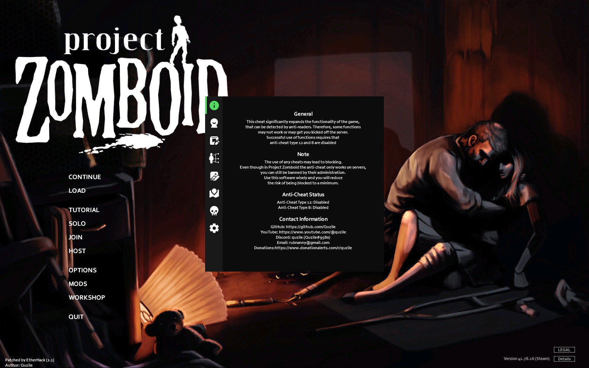
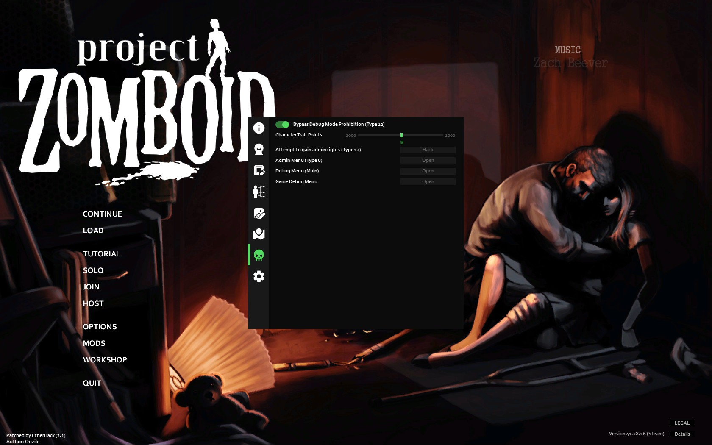
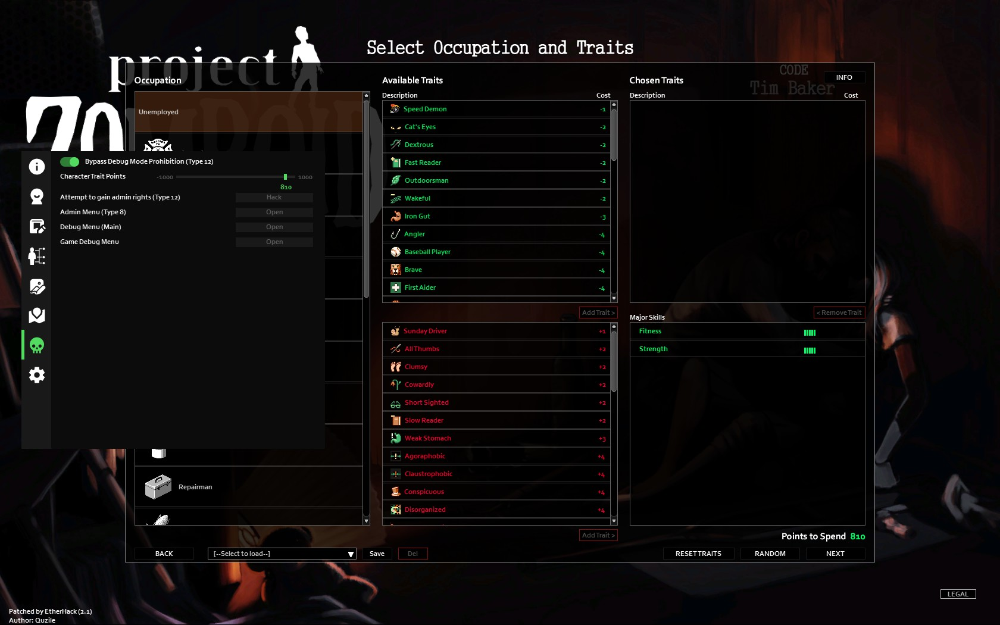
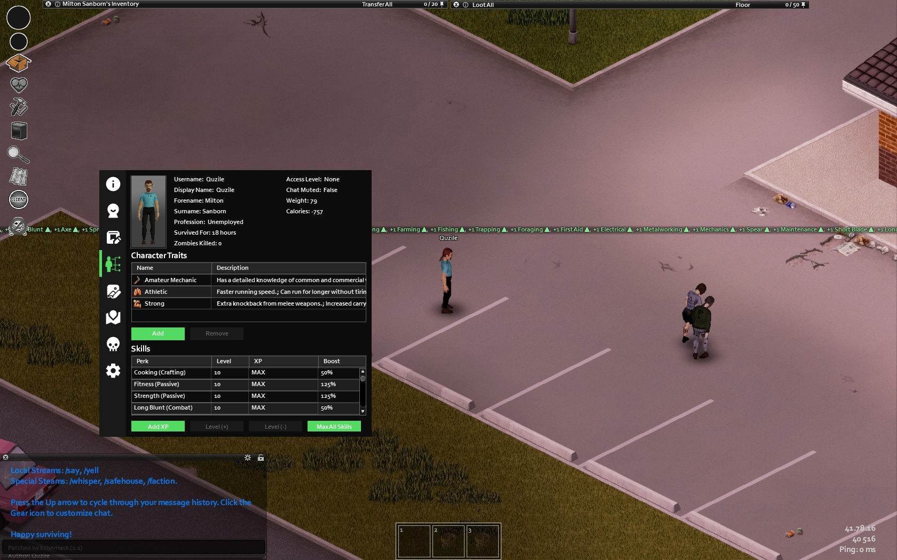
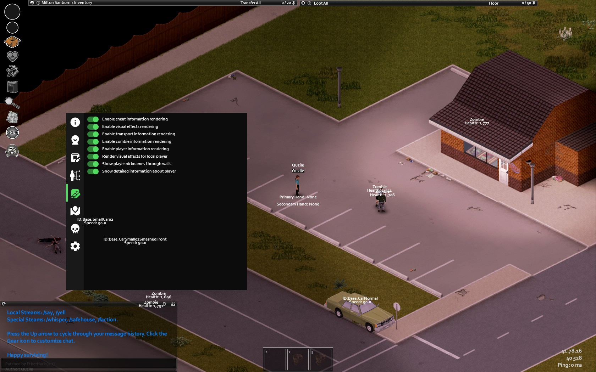
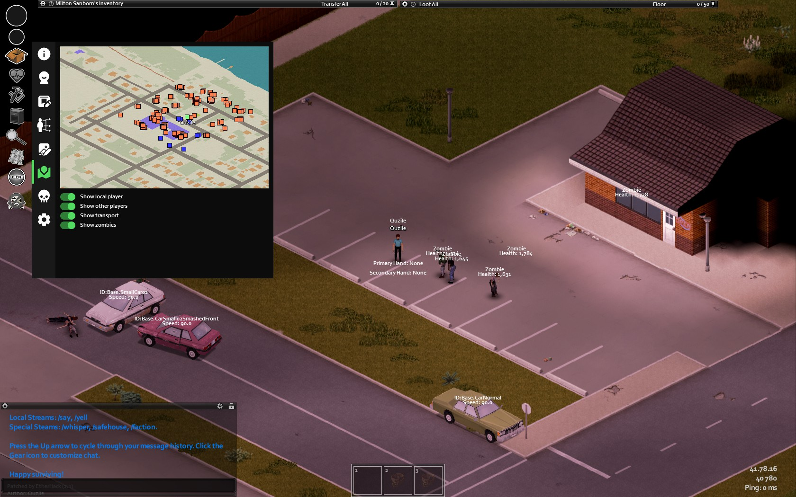
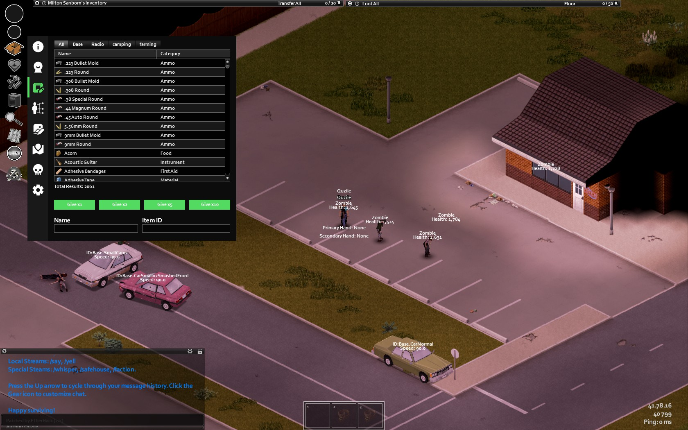
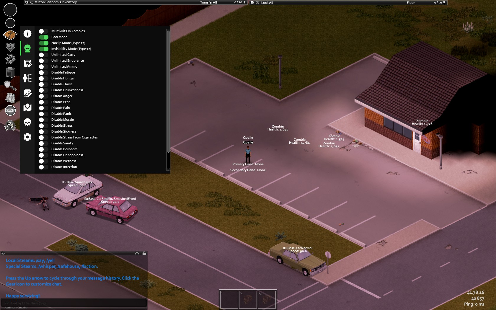
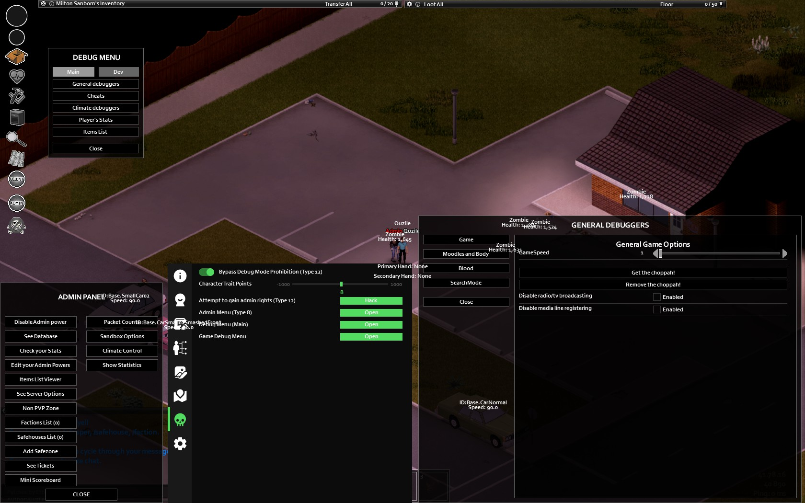

<h1 align="center">Project-Zomboid-EtherHack</h1>

<p align="center">
  
  
  
  
  
</p>

This is a cheat written in Java(API) and Lua(GUI) for Project Zomboid. It is aimed at providing the game with additional functionality that allows users to get some benefits. Please use responsibly and understand the consequences that may arise as a result of improper use.
The performance of the cheat was tested on the latest version of the game `41.78.16 (Steam)` (July 31, 2023).

You can watch the cheat [installation video](https://www.youtube.com/watch?v=Olx7O3HyeZc) and see its main functions in action.

Also, if desired, you can provide [support <3](https://www.donationalerts.com/r/quzile)

## Table of Contents
- [Cheat functionality](#cheat-functionality)
- [Demo](#demo)
- [Getting Started](#getting-started)
- [Prerequisites](#prerequisites)
- [Installation](#installation)
- [Uninstallation](#uninstallation)
- [Usage](#usage)
- [For developer](#for-developer)
- [Special thanks](#special-thanks)
- [Contributing](#contributing)
- [Disclaimer](#disclaimer)
- [License](#license)
- [Contact](#contact)

## Cheat functionality

| Function                                   | Working in multiplayer | Working in a co-op | Description                                                                                                                                                                                                                                                   |
|--------------------------------------------|:----------------------:|:------------------:|---------------------------------------------------------------------------------------------------------------------------------------------------------------------------------------------------------------------------------------------------------------|
| Debug Mode Bypass                          |         -/+(*)         |         +          | Allows you to use the developer mode in multiplayer (when starting the game with -debug connection is not possible). When you click the right mouse button, additional menus appear, including changing clothes, repairing cars, teleporting on the map, etc. |
| MultiHit Zombie                            |           +            |         +          | Enables multi-hit zombie mode                                                                                                                                                                                                                                 |
| Invisible                                  |         -/+(*)         |         +          | Allows you to become invisible to everyone                                                                                                                                                                                                                    |
| God Mode                                   |           +            |         +          | Gives immortality to the character                                                                                                                                                                                                                            |
| No Clip                                    |         -/+(*)         |         +          | Ability to pass through walls and objects                                                                                                                                                                                                                     |
| Unlimited Carry                            |           +            |         +          | Enable infinite load capacity, including for third-party containers                                                                                                                                                                                           | |
| Unlimited Ammo                             |           +            |         +          | Disables the need for ammo. You need to move the shutter                                                                                                                                                                                                      | |
| Unlimited item durability and auto repair  |           +            |         +          | Allows you to automatically repair all items in your inventory and gives unlimited durability to the item in your hands                                                                                                                                       | |
| Disable Character Needs (by category)      |           +            |         +          | Disables all the needs of the character, sets its characteristics to the maximum - positive - level (stress, panic, etc.)                                                                                                                                     |
| Change Trait Points                        |           +            |         +          | Allows you to change trait points when creating a character                                                                                                                                                                                                   |
| Draw Player Info and Nickname              |           +            |         +          | Draw the nickname and information about the player on top of the walls                                                                                                                                                                                        |
| Game Debugger                              |           +            |         +          | Opens the debugging window                                                                                                                                                                                                                                    |
| Items Creator                              |           +            |         +          | The item creation menu, the ability to sort, search, etc.                                                                                                                                                                                                     |
| Player Editor                              |           +            |         +          | The character editing menu, the ability to add skills, perks, etc.                                                                                                                                                                                            |
| Get Admin Access                           |         -/+(*)         |         +          | Obtaining administrator rights on the server                                                                                                                                                                                                                  |
| Open Admin Menu                            |         -/+(*)         |         +          | Opens the admin window                                                                                                                                                                                                                                        |
| Open Debug Menu(main)                      |           +            |         +          | Opens the main debugging menu (as with the standard method)                                                                                                                                                                                                   |
| MiniMap                                    |           +            |         +          | Display of map, players, cars and zombies                                                                                                                                                                                                                     |
| Medic's Menu                               |           +            |         +          | Includes a set of functions for the treatment of body parts and their damage                                                                                                                                                                                  |
| Mechanics Menu                             |           +            |         +          | Includes a set of functions for restoring parts of vehicle and their damage                                                                                                                                                                                   |
| Learn all recipes                          |           +            |         +          | Allows you to learn all available crafting recipes                                                                                                                                                                                                            |
| 360 Vision                                 |           +            |         +          | Will allow you to see zombies, players and vehicles in 360 degrees                                                                                                                                                                                            |
| and much more                              |           -            |         -          | -                                                                                                                                                                                                                                                             |

(*) - These functions work in multiplayer, provided that some types of anti-cheats are disabled, otherwise it will kick. As a rule, for servers with mods, some types are disabled, for example, [type 12](https://www.unknowncheats.me/forum/other-mmorpg-and-strategy/522818-project-zomboid-anti-cheat-types.html), but for full operation, [type 8](https://www.unknowncheats.me/forum/other-mmorpg-and-strategy/522818-project-zomboid-anti-cheat-types.html) is required to be disabled

## Demo










## Getting Started

This section will provide information on how to get a local copy of the project up and running.

### Prerequisites

This tool requires:

-   [Java 17](https://www.oracle.com/java/technologies/downloads/) or newer
-   Steam copy of [Project Zomboid](https://store.steampowered.com/app/108600/Project_Zomboid/)

### Installation

1. Download and install Java on your computer
2. Make sure that the path to Java is set in your environment variables

(For Windows: `WIN + X` -> `"System"` -> `"Advanced System Parameters"` -> `"Environment Variables"` -> `Double click on "Path"` -> `Insert path to java, for example "C:\Program Files\Java\jdk-20\bin"`)

3. Clone the repository
4. Open the project in the IDE and build the executable via Gradle `.jar` file
5. Move the created `.jar` to the root folder of the game 

(For example, `c:\Steam\steamapps\common\ProjectZomboid`)

6. Open the console in the root folder and run the following command: 

```
java -jar ./EtherHack-{yourVersion}.jar --install
```

`{yourVersion}` - Specify your version of the cheat

For example, for release 2.0, the command will look like this:
```
java -jar ./EtherHack-2.0.jar --install
```
### Uninstallation
Open the console in the root folder and run the following command:
```
java -jar ./EtherHack-{yourVersion}.jar --uninstall
```

`{yourVersion}` - Specify your version of the cheat

For example, for release 2.0, the command will look like this:
```
java -jar ./EtherHack-2.0.jar --uninstall
```

## Usage

After successfully installing the cheat, you need to log in to the game. When loading, the cheat logo will appear in front of the main logo, in the game itself (menu and in the game session) in the lower left corner there will be information about the cheat. The name of the game window will also change.

To open/close the cheat menu, press `Insert`

## For developer
This project implements a system of user translations. Each language file is located along the path `EtherHack/translations/{countryKey}.txt`.
You can add your own language by creating a file and naming it with your country code, for example `EN.txt`, as well as filling it out using 
a template:

```text
{
    key1 = "Test1",
    key2 = "Test2 {yourVariable}"
}
```

Then in the java or lua code you can read the translation and replace some arguments if necessary:
```java
EtherMain.getInstance().etherTranslator.getTranslate("key1");
// output: Test1
```
```lua
print(getTranslate("key2", {yorVariable = "Hello World!"}))
--output: Test2 Hello World!
```
A system of subscribing to lua events from java has been implemented, for this it is necessary to subscribe to `EventSubscriber` in the constructor and add the appropriate annotation to the desired method:
```java
public yourClass() {
    EventSubscriber.register(this);
}
        
@SubscribeLuaEvent(
    eventName = "yourLuaEventName" // for example: OnPostUIDraw
)
public void yourMethod() {
    // ToDo
}

```
You can also connect your own Lua modules via the main lua file - `EtherHackMenu.lua`.Add the path to your file to the following table:    
```lua
local etherModules = {
    --otherModules
    "your/path/to/file.lua"
}
```
Or strictly specify the instructions for connecting the dependency:
```lua
requireExtra("your/path/to/file.lua");
```
## Special thanks

I would like to express my special gratitude to the following people who have made a huge contribution and provided invaluable support to the development of this project:

<p align="center">
  
</p>

## Contributing

We welcome contributions from the community. If you want to contribute, please fork the repository and create a pull request with your changes.

## Disclaimer

This software is provided 'as-is', without any express or implied warranty. In no event will the author be held liable for any damages arising from the use of this software. Use of this software may also violate the terms of service of the game and could lead to your account being banned. Use at your own risk.

## License

This project is under `MIT License` - see the LICENSE file for details.

## Contact

If you have any questions, feel free to reach out to me at:

Email: `rubranny@gmail.com`

Discord: `quzile` or `Quzile#9580`

Discord Server: [Link](https://discord.gg/u865tphDe)

FAQ: [Link](https://discord.gg/a6nnWkMyG)
